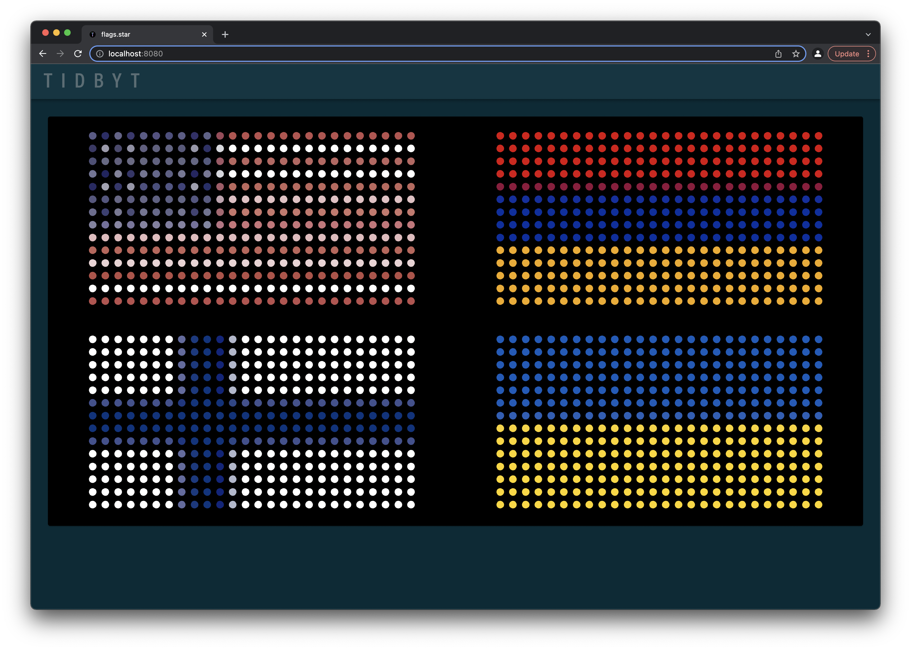
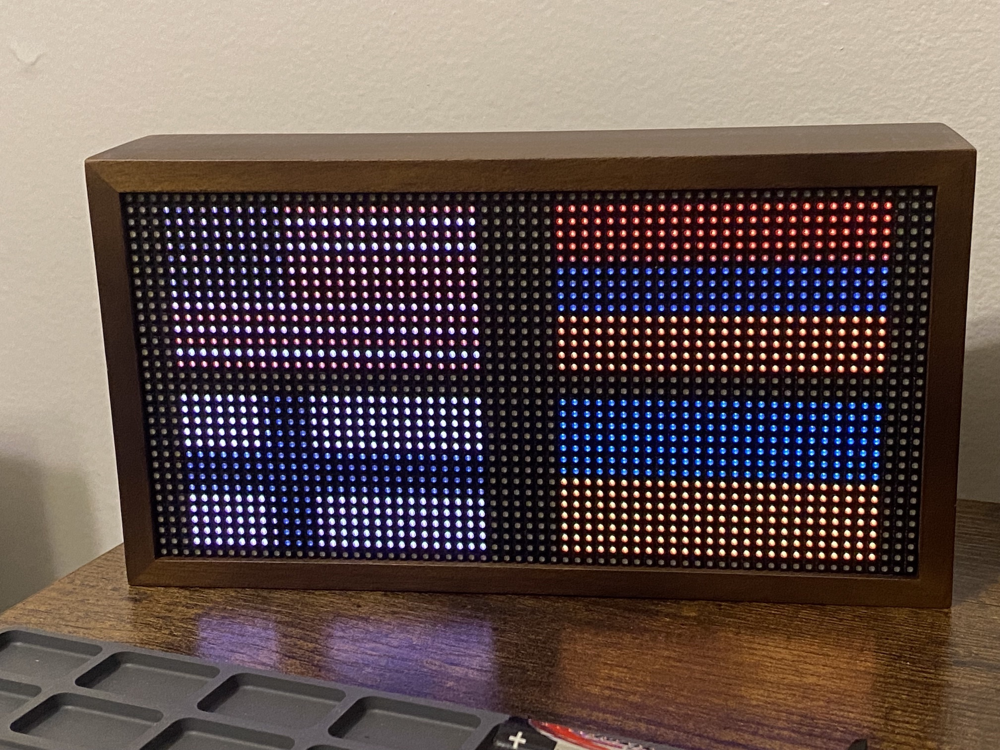

# Tidbyt Flags
<a href="https://tidbyt.com/" target="_blank">Tidbyt</a> country flags applet 🇺🇸
 

A simple applet for Tidbyt that provides a way to display a group of country flags of importance to an individual.

To change the flags displayed, I recommend downloading a PNG of your chosen flag, use <a href="https://www.pixilart.com/" target="_blank">PIXILART</a> or a similar app to create the flag image, convert the PNG to <a href="https://onlinepngtools.com/convert-png-to-base64" target="_blank">base64</a>, and then replace the image context in the .star file

A simple way to express the places that matter most to you.

